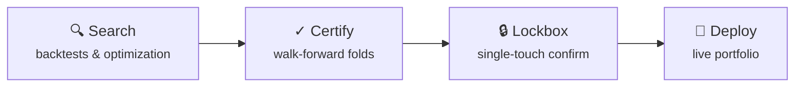

<div align="center">

# Public Portfolio Challenge

**4 AI agents. One open runbook. Real $25K, live and verifiable.**

<br />

[](https://nexustrade.io/shared-portfolio/69a7dc7cf99e43688fcec567)
[](https://nexustrade.io/developers)
[](episode-10/BAKEOFF_RUNBOOK.md)
[](#get-started)

<br />

[](https://nexustrade.io/shared-portfolio/69a7dc7cf99e43688fcec567)

*Live portfolio card — generated from current positions. [Open the full dashboard →](https://nexustrade.io/shared-portfolio/69a7dc7cf99e43688fcec567)*

<br />

<!-- SCOREBOARD:START -->
| Account value | Total return | Return vs. SPY | Max drawdown | Days live |
| ---: | ---: | ---: | ---: | ---: |
| $32,276.56 | +29.11% | +14.54 pp (SPY +14.57%) | −12.14% | 168 |

<sub>As of August 24, 2026. Same-window comparison begins with the first stored live observation. [Portfolio data](https://nexustrade.io/api/share-portfolio/portfolio/69a7dc7cf99e43688fcec567/history) · [Performance data](https://nexustrade.io/api/share-portfolio/69a7dc7cf99e43688fcec567/performance) · [SPY data](https://nexustrade.io/api/stock/SPY/history/price?brokerage=Public) · refreshed weekly by GitHub Actions.</sub>
<!-- SCOREBOARD:END -->

<br />

**Quick start:** [Copy the live incumbent](https://nexustrade.io/shared-portfolio/69a7dc7cf99e43688fcec567?deploy=1) · [Connect MCP](#step-3--connect-your-ai-tool) → `python3 start.py` → **paste `prompt.txt` into a fresh agent chat**

</div>

---

## Contents

- [What is this?](#what-is-this)
- [Live books](#live-books)
- [Agent bakeoff](#agent-bakeoff)
- [What this repo gives you](#what-this-repo-gives-you)
- [How the runbook works](#how-the-runbook-works)
- [What's inside](#whats-inside)
- [Community leaderboard](#community-leaderboard)
- [Get started](#get-started)
- [Risk disclaimer](#risk-disclaimer)
- [More links](#more-links)

---

## What is this?

In February 2026 I deposited **$25,000** into a live [Public](https://public.com) brokerage account on NexusTrade and made the entire book public — every position, every fill, every model test, every bug, every failure.

Not paper. Not a backtest screenshot. **Real money, documented in real time.**

The live story is a blog series. **Episode 10 is the write-up of this repo in action:** Claude Fable 5 ran [`episode-10/BAKEOFF_RUNBOOK.md`](episode-10/BAKEOFF_RUNBOOK.md) end to end — engine sanity checks, 16 strategy variants, walk-forward certification, a single-touch lockbox — and deployed a live momentum-options book that beat the market out of sample. Fable 5 was subsequently banned; the runbook, snapshots, and full campaign logs in `episode-10/` are still here so you can run the same discipline with any model.

| | |
| --- | --- |
| **[Full series →](https://nexustrade.io/blog/series/public-portfolio-challenge)** | Ten episodes and counting: model bakeoffs, deploy day, production bugs, week-one gains, panic sells, engine rewrites, and the open runbook. |
| **[Episode 1 →](https://nexustrade.io/blog/im-giving-an-ai-access-to-my-public-trading-account-heres-how-you-can-watch-it-destroy-25000-20260228)** | Where it started — why $25k, why Public, why total transparency. |
| **[Episode 10 →](https://nexustrade.io/blog/claude-fable5-built-my-live-options-strategy-then-got-banned-20260614)** | The full story of Fable 5 running this runbook — every gate, engine bug, and dead end logged in [`FABLE_CAMPAIGN.MD`](episode-10/FABLE_CAMPAIGN.MD). |
| **[Episode 10 on Medium →](https://medium.com/p/b5b2db76dc6c)** | Same article, syndicated on Medium — included here so readers who follow the challenge off-platform can find it without hunting. |
| **[Episode 11 addendum →](episode-11/addendum/SHORT_TERM_DEBIT_SPREADS_20260824.md)** | Short-term debit-spread rule, matched walk-forward results, live-book changes, current cadence gates, and Public symbol eligibility. |
| **[Episode 11 combined-book research →](episode-11/addendum/COMBINED_LONG_CALL_RESEARCH_20260824.md)** | Cash-account constraint, long-call-only search, walk-forward evidence, failed lockbox, event audit, and final no-deploy decision. |

**This repo is the open playbook.** Episode 10 documents one agent's run through it. The runbook is yours to replay with whatever model you have. [The agents don't just trade the account—they commit to this repo.](https://github.com/austin-starks/Public-Portfolio-Challenge/commits/main/)

---

## Live books

Three Public brokerage books. Each has its own folder. Do not merge them.

| Book | Public | Capital | Live config | Runbook |
| --- | --- | ---: | --- | --- |
| **Public Portfolio Challenge: Original** | live id `69a7dc7acdb6bf6a4681d36c` | $25,000 | Episode 10 incumbent. Do not touch. | [`episode-10/`](episode-10/) |
| **Public Portfolio Challenge: Biotech** | `5OH86568` · id `6a5e20a3ea0d6db55c69a171` | $5,500 | **SHORT-TERM SPREAD BOOK:** long calls retained; debit verticals capped at 180 DTE; Constant. Auto-approve false. | [`episode-11/moderna/`](episode-11/moderna/) |
| **Public Portfolio Challenge: Semis** | `5OH79160` · id `6a45f218e6b1f2131d1f26be` | $8,000 | **SHORT-TERM SPREAD BOOK:** 90-180 DTE vertical entry retained; Constant. Auto-approve false. | [`episode-semis/`](episode-semis/) |

Semis method and the certified SMH comparison live in [`episode-semis/RUNBOOK.md`](episode-semis/RUNBOOK.md). Biotech KEEP stays in [`episode-11/moderna/RUNBOOK.md`](episode-11/moderna/RUNBOOK.md) — do not rewrite or merge that body.

**August 24 deployment audit:** [`audits/2026-08-24-biotech-semis-deployment-audit.md`](audits/2026-08-24-biotech-semis-deployment-audit.md) records the PSNL, TECH, and PACB cleanup, calendar-matched Biotech control, fresh Semis re-certification, rejected MRNA-core and vertical-first alternatives, Constant-frequency verification, and the completed BTC-dust cleanup.

**August 24 cash-account addendum:** [`audits/2026-08-24-public-cash-account-calls-only-addendum.md`](audits/2026-08-24-public-cash-account-calls-only-addendum.md) records the temporary calls-only test, the return comparison that rejected it, restoration of both higher-return spread books, the cooldown diagnosis, and the options-level notable-event fix.

---

## Agent bakeoff

Four agents received the same Episode 10 discipline. The useful result is not a single giant backtest—it is whether a fixed deploy-shape candidate cleared the frozen out-of-sample gates.

| Agent | Best comparable OOS mean return | Passed every gate? | Outcome | Notable failure |
| --- | ---: | --- | --- | --- |
| [Claude Code](episode-10/CLAUDE_CODE_CAMPAIGN_LOG_20260613T165226Z.md#deliverable--verdict-no-deployable-finalist-honest-no-deploy) | **+53.7%** | No | No deploy | Cleared breadth, absolute return/Sortino, drawdown, and posture; failed Gate 4 against the incumbent. |
| [Codex](episode-10/CODEX_CAMPAIGN_LOG_20260613T165248Z.md#final-wf-verdict) | **+32.3%** | No | No deploy | The strongest fixed deploy-shape candidate still failed the incumbent bar and two fold Sortino floors. |
| [Cursor](episode-10/CURSOR_CAMPAIGN_LOG_20260613T165224Z.md#session-3--assembled-book-gate-evaluation-2026-06-13t1732z) | **+33.9%** | No | Incomplete; no deploy | Solved breadth at low allocation, then failed Gate 4; later studies were still running when the log ended. |
| [Claude Fable 5](episode-10/FABLE_CAMPAIGN.MD#head-to-head-for-deploy-both-measured-directly-on-the-deployable-object) | **+88.3%** | No—owner override | Deployed | Strong return and drawdown, but missed strict breadth, fold-Sortino, stability, and posture gates; later engine fixes weakened the selection-provenance claim. |

**Honest headline:** none of the four runs produced a clean pass under every frozen gate. Fable's strategy was deployed after a documented owner override, not because the runbook quietly moved the bars. Follow the links for fold-level evidence and every failure.

---

## What this repo gives you

<table>
<tr>
<td width="33%" valign="top">

### No install

Connect the NexusTrade MCP server to Cursor, Claude, or any OAuth-capable client. No NexusTrade install, no API keys to rotate — OAuth signs you in once in the browser. (Grab `start.py` + `example_profile.json` from the repo, or just copy them from GitHub.)

</td>
<td width="33%" valign="top">

### One prompt

[`episode-10/BAKEOFF_RUNBOOK.md`](episode-10/BAKEOFF_RUNBOOK.md) is a self-contained agent brief — paste it into a fresh session and let the agent execute. It prescribes *what* must be true, never *how* to achieve it. New here? Take the [fast path](#get-started) instead — run `python3 start.py` and paste one prompt.

</td>
<td width="33%" valign="top">

### Real rigor

Walk-forward validation, a held-out lockbox, deploy gates, and capital-posture rules. A high in-sample backtest number is never the headline.

</td>
</tr>
</table>

---

## How the runbook works

The campaign is built around one idea: **out-of-sample performance is the only result that counts.**


```mermaid
flowchart LR
  A["🔍 Search<br/><small>backtests & optimization</small>"] --> B["✓ Certify<br/><small>walk-forward folds</small>"]
  B --> C["🔒 Lockbox<br/><small>single-touch confirm</small>"]
  C --> D["🚀 Deploy<br/><small>live portfolio</small>"]
```

| Layer | Job |
| --- | --- |
| **Search** | Invent and tune candidate strategies fast — variants, sweeps, backtests. |
| **Certify** | Walk-forward: each fold optimizes in-sample, scores on held-out OOS the optimizer never saw. |
| **Lockbox** | A final untouched window. One touch. No peeking. |
| **Deploy** | Clone to a live portfolio, parity-check, attach monitoring. |

Fixed by the runbook: a frozen watchlist (**20 names** in the Episode 10 bakeoff), $25,000 capital, the fold calendar, the gates, the lockbox rules, and the deploy procedure. **Yours to design:** signals, structures, deltas, exits, sizing — anything that clears the gates is valid.

<details>
<summary><strong>The watchlist (frozen — 20 names)</strong></summary>

<br />

`ANET` · `DUOL` · `HOOD` · `LLY` · `GS` · `META` · `TSM` · `AVGO` · `XOM` · `COP` · `OSCR` · `AMAT` · `ADI` · `DDOG` · `OKTA` · `NET` · `APP` · `GLD` · `MU` · `SNDK`

</details>

---

## What's inside

The discipline lives in two forms. The **skills library** ([`skills/`](skills/)) is the runbooks decomposed into composable agent skills on the [open `SKILL.md` standard](https://agentskills.io) — the **same folder runs in Claude Code, Codex CLI, Cursor, Gemini CLI, Copilot and ~15 other tools** (`skills/install.sh` handles each tool's path + adapter). Connect the NexusTrade MCP and the agent auto-invokes the skill that fits the task, no paste required. The **episode folders** preserve the complete public timeline: historical indexes for Episodes 1–9, then the original runbooks and campaign logs for the reproducible campaigns.

```
skills/                      ← the skills library (install into ANY agent — see skills/README.md)
├── README.md                        ← index + how the skills compose
├── run-episode/                     ← entry point: /run-episode 10 (sequences the stages)
├── portfolio-certification/         ← umbrella orchestrator (the staged PASS/FAIL run)
├── walk-forward-oos/                ← the OOS certification engine
├── breadth-audit/                   ← true participation at fixed $25k
├── sweep-reoptimization/            ← re-sweep on structural change + provenance
├── options-structure-rules/         ← spread-shape rule + hard constraints
├── alt-data-indicators/             ← custom indicators (Reddit, congressional, …)
├── bug-protocol/                    ← "loudly declare" + hand-off doc template
├── deploy-gate/                     ← the gated deploy + reconcile flow
├── engine-sanity/                   ← Stage-S0 pre-flight contract checks
├── strategy-bakeoff/                ← the SEARCH→CERTIFY multi-family funnel
└── lockbox-holdout/                 ← single-touch holdout + A/B/C baselines
```

Each episode is a self-contained folder: the **runbook** to paste, plus the **campaign logs** from each operator/agent run.

Episodes 1–9 predate the current repository format. Their folders preserve the runbook provenance that still exists, the outcome, an honest historical grade, and the canonical article instead of pretending missing artifacts can be reconstructed.

| Episode | Outcome | Grade | Record |
| ---: | --- | --- | --- |
| 1 | Opened the real-money challenge and established the public record. | Historical; not scored under current gates | [`episode-01/`](episode-01/) |
| 2 | Converted expert feedback into a more disciplined agent workflow. | Historical; not scored under current gates | [`episode-02/`](episode-02/) |
| 3 | Compared 11 AI models on strategy construction. | Research bakeoff; pre-current gates | [`episode-03/`](episode-03/) |
| 4 | Tested automated hill-climbing and found optimization did not automatically beat the first attempt. | Research result; pre-current gates | [`episode-04/`](episode-04/) |
| 5 | Reached the first live options deployment milestone. | Deployed under episode-era controls | [`episode-05/`](episode-05/) |
| 6 | Documented day-one live behavior. | Live observation; not a certification | [`episode-06/`](episode-06/) |
| 7 | Hit a close-order failure and rebuilt the risk engine around it. | Failure documented and remediated | [`episode-07/`](episode-07/) |
| 8 | Published the week-one gain with the live book visible. | Live snapshot; not forward evidence | [`episode-08/`](episode-08/) |
| 9 | Documented the gain, the panic sell, and the human override risk. | Failure documented | [`episode-09/`](episode-09/) |

```
episode-10/
├── BAKEOFF_RUNBOOK.md             ← paste this into a fresh MCP session
├── RUNBOOK_OG.md                  ← the original (Episode 1) runbook, kept for reference
├── snapshots/                     ← baseline + incumbent seed portfolios the runbook loads
├── addendum/                       ← entry/exit redesign, deploy evidence, diagram, and bug note
├── FABLE_CAMPAIGN.MD              ← operator run log (Fable 5)
├── CLAUDE_CODE_CAMPAIGN_LOG_*.md  ← agent run log (Claude)
├── CODEX_CAMPAIGN_LOG_*.md        ← agent run log (Codex)
└── CURSOR_CAMPAIGN_LOG_*.md       ← agent run log (Cursor)
```

| File | What it is |
| --- | --- |
| [`skills/`](skills/) | **The skills library.** 12 composable agent skills on the open [`SKILL.md`](https://agentskills.io) standard (Claude Code, Codex, Cursor, Gemini, Copilot, …) — the whole certification discipline, auto-invoked instead of pasted. Entry point: `/run-episode 10`. [`skills/README.md`](skills/README.md) is the index. |
| [`start.py`](start.py) + [`example_profile.json`](example_profile.json) | **Start here (fast path).** `python3 start.py` walks you through your watchlist + risk tolerance, writes `profile.json` and a `prompt.txt` to paste — the agent builds *you* a personalized strategy. No runbook needed. |
| [`episode-10/BAKEOFF_RUNBOOK.md`](episode-10/BAKEOFF_RUNBOOK.md) | The agent brief you run — walk-forward validation, lockbox, deploy gates. Paste and execute top to bottom. |
| [`episode-10/RUNBOOK_OG.md`](episode-10/RUNBOOK_OG.md) | The original Episode-1 runbook, kept for reference (the brief has since expanded). |
| [`episode-10/snapshots/`](episode-10/snapshots) | Baseline A/B and incumbent seed portfolios the runbook loads via `create_portfolio`. |
| [`episode-10/addendum/`](episode-10/addendum) | Episode 10 entry/exit redesign addendum: runbook, campaign evidence, OOS comparison diagram, and bug note. |
| [`episode-10/addendum/RAW_RETURN_VNEXT_RESULTS_20260817.md`](episode-10/addendum/RAW_RETURN_VNEXT_RESULTS_20260817.md) | Raw-return vNext sweep, GA, walk-forward, event audit, winners/losers, risk trade-offs, and deployment record. |
| [`episode-11/addendum/SHORT_TERM_DEBIT_SPREADS_20260824.md`](episode-11/addendum/SHORT_TERM_DEBIT_SPREADS_20260824.md) | Episode 11 addendum: 180-DTE debit-spread ceiling, live Biotech/Semis replacements, matched walk-forward evidence, and symbol-level Public eligibility. |
| [`episode-11/addendum/COMBINED_LONG_CALL_RESEARCH_20260824.md`](episode-11/addendum/COMBINED_LONG_CALL_RESEARCH_20260824.md) | Episode 11 combined-book campaign: long calls only, three mechanism families, walk-forward finalist, failed frozen lockbox, optimizer cooldown fix, and no-deploy record. |
| Campaign logs | Per-run logs from each operator/agent: [`FABLE_CAMPAIGN.MD`](episode-10/FABLE_CAMPAIGN.MD), [`CLAUDE_CODE_…`](episode-10/CLAUDE_CODE_CAMPAIGN_LOG_20260613T165226Z.md), [`CODEX_…`](episode-10/CODEX_CAMPAIGN_LOG_20260613T165248Z.md), [`CURSOR_…`](episode-10/CURSOR_CAMPAIGN_LOG_20260613T165224Z.md). |
| [`episode-11/moderna/RUNBOOK.md`](episode-11/moderna/RUNBOOK.md) | Biotech KEEP — design-frozen. Live name **Public Portfolio Challenge: Biotech**. Do not rewrite or merge this body. |
| [`episode-semis/RUNBOOK.md`](episode-semis/RUNBOOK.md) | Semiconductor S13 A — SMH-bar walk-forward, exam-only lockbox. **Now running** on Public `5OH79160`. |

```
episode-semis/
├── README.md                      ← index for the Semis Public book
├── RUNBOOK.md                     ← paste this; S13 A is design-frozen
└── CAMPAIGN_LOG.md                ← facts already recorded (no invented fills)
```

**Episode 11** is the Biotech KEEP book at [`episode-11/moderna/`](episode-11/moderna/) — **Public Portfolio Challenge: Biotech** (Public `5OH86568`). The semiconductor book is a separate episode at [`episode-semis/`](episode-semis/) — **Public Portfolio Challenge: Semis** (Public `5OH79160`), now running S13 A. Do not steal the Episode 11 folder for chips.

---

## Community leaderboard

**Think your agent can beat the incumbent without moving the gates? Prove it.** Fork the repo, run the campaign on NexusTrade, and open a PR under [`community-runs/`](community-runs/).

<!-- COMMUNITY_LEADERBOARD:START -->
| Rank | Run | Agent | OOS return | OOS Sortino | Worst max drawdown | Gates | Evidence |
| ---: | --- | --- | ---: | ---: | ---: | --- | --- |
| — | No verified community runs yet | — | — | — | — | — | [Submit the first run](community-runs/README.md) |
<!-- COMMUNITY_LEADERBOARD:END -->

Only runs that pass every current gate are ranked by mean OOS return. Failed runs stay visible—the point is reproducibility, not survivor bias. Start with the [submission guide](community-runs/README.md) and [result template](community-runs/example/result.json).

---

## Get started

### Step 1 — Developers page

Open **[nexustrade.io/developers](https://nexustrade.io/developers)**.

[](https://nexustrade.io/developers)

### Step 2 — Create a free account

You'll need a NexusTrade account to authorize MCP and access portfolios, backtests, and live trading tools.

[](https://nexustrade.io/register)

### Step 3 — Connect your AI tool

**Recommended: OAuth.** No keys to copy, rotate, or leak. Sign in once in the browser when your client first calls a NexusTrade tool.

```
https://nexustrade.io/api/mcp
```

#### Cursor *(recommended)*

1. On the [Developers page](https://nexustrade.io/developers), expand **API Keys**.
2. Under **Connect an AI tool to NexusTrade**, click **Add to Cursor**.
3. OAuth runs automatically on first tool use.

[](https://nexustrade.io/developers)

[](https://nexustrade.io/developers)

<details>
<summary><strong>Manual Cursor config</strong></summary>

```json
{
  "mcpServers": {
    "nexustrade": {
      "url": "https://nexustrade.io/api/mcp"
    }
  }
}
```

</details>

<details>
<summary><strong>Claude Desktop / Claude Code</strong></summary>

Click **Copy install command** on the Developers page, or:

```bash
claude mcp add nexustrade --transport http https://nexustrade.io/api/mcp
```

</details>

<details>
<summary><strong>VS Code, ChatGPT, Windsurf, Zed, and other MCP clients</strong></summary>

Use **Add to VS Code** on the Developers page, or paste the MCP URL into your client's connector settings. OAuth 2.1 discovery works the same everywhere.

</details>

<details>
<summary><strong>Advanced: API keys</strong></summary>

For scripts without OAuth support: expand **Advanced: API Keys** on the Developers page and pass the key in the `Authorization` header. See the [API Reference](https://nexustrade.io/docs/api-reference/overview).

</details>

### Step 4 — Run it

**Fast path — a personalized strategy in one paste.** Run:

```bash
python3 start.py
```

On the first run it walks you through a few questions (defaults come from [`example_profile.json`](example_profile.json) — mine) and writes your **`profile.json`**, then writes your ready-to-paste prompt to **`prompt.txt`**. Open `prompt.txt`, copy it, and paste into a **fresh** MCP-connected chat. Run it again any time after editing `profile.json` to regenerate the prompt.

No Python? Copy `example_profile.json` to `profile.json`, edit it, then paste the JSON into your agent with one line: *"Build me a personalized strategy from this profile, backtest it out-of-sample, and ask before deploying."*

Either way, the agent designs a strategy on your names, backtests it, compares it to buy-and-hold, and **asks before risking a dollar**.

<details>
<summary><strong><code>profile.json</code> fields</strong></summary>

- `risk_tolerance` — `conservative` · `moderate` · `aggressive`
- `asset_classes` — any of `stocks`, `crypto`, `options`
- `watchlist` — the only tickers the agent may trade
- `capital` — starting USD

</details>

**Full rigor — the runbook.** Want walk-forward validation, a held-out lockbox, and deploy gates? Open [`episode-10/BAKEOFF_RUNBOOK.md`](episode-10/BAKEOFF_RUNBOOK.md), paste the **entire file** into a fresh session, and tell the agent: **execute top to bottom, do not ask clarifying questions.** Log your run alongside the per-agent campaign logs in `episode-10/`.

---

## Risk disclaimer

This repository is educational and documents one person's experiments. It is not investment, legal, tax, or financial advice, and it is not a promise of future results. Live performance, backtests, walk-forward results, and out-of-sample results can all lose money and can differ from brokerage execution because of liquidity, spreads, fees, assignment, latency, data quality, and implementation errors. Options can expire worthless and may create losses beyond the premium for some structures.

Nothing in this repository should place a trade by itself. Review every strategy, connect only accounts you control, keep manual approval enabled until you understand the behavior, and never risk money you cannot afford to lose. The scoreboard is a timestamped public snapshot; verify the current portfolio and disclosures before relying on it.

---

## More links

| | |
| --- | --- |
| [Live portfolio](https://nexustrade.io/shared-portfolio/69a7dc7cf99e43688fcec567) | Positions and P&L in real time |
| [Copy the live incumbent](https://nexustrade.io/shared-portfolio/69a7dc7cf99e43688fcec567?deploy=1) | Open the marketplace copy/deploy flow; review before connecting real money |
| [Blog series](https://nexustrade.io/blog/series/public-portfolio-challenge) | The full documented journey |
| [Episode 1](https://nexustrade.io/blog/im-giving-an-ai-access-to-my-public-trading-account-heres-how-you-can-watch-it-destroy-25000-20260228) | How the challenge began |
| [Episode 10](https://nexustrade.io/blog/claude-fable5-built-my-live-options-strategy-then-got-banned-20260614) | Fable 5 ran this runbook and deployed a live book — full story + links to campaign logs |
| [Episode 10 on Medium](https://medium.com/p/b5b2db76dc6c) | Syndicated copy of the same article (for readers off NexusTrade) |
| [Developers](https://nexustrade.io/developers) | MCP setup |
| [MCP tools reference](https://nexustrade.io/docs/api-reference/mcp-tools-utility) | Every tool the runbook can call |
| [API overview](https://nexustrade.io/docs/api-reference/overview) | REST + auth |

---

<div align="center">

<br />

**[Copy the incumbent](https://nexustrade.io/shared-portfolio/69a7dc7cf99e43688fcec567?deploy=1), or fork it and beat it. Run `start.py` on your own names—or paste the runbook for the full discipline.**

If it survives walk-forward and the lockbox, deploy it. If it doesn't, you found that out before risking a dollar.

<br />

[](https://nexustrade.io)
[](https://nexustrade.io/shared-portfolio/69a7dc7cf99e43688fcec567)

</div>
